# Tax Compliance Workflow Platform

A beginner-friendly modular monolith for managing recurring tax and compliance work across organizations, legal entities, jurisdictions, templates, and generated task occurrences.

## Screenshots

The images below were captured from a local development run of the Angular frontend and ASP.NET Core API. To regenerate them after UI changes:

```bash
cd e2e
npm install
npx playwright install chromium
npx playwright test capture-readme-screenshots
```

### Authentication

| Sign in | Password recovery |
|---------|-------------------|
| 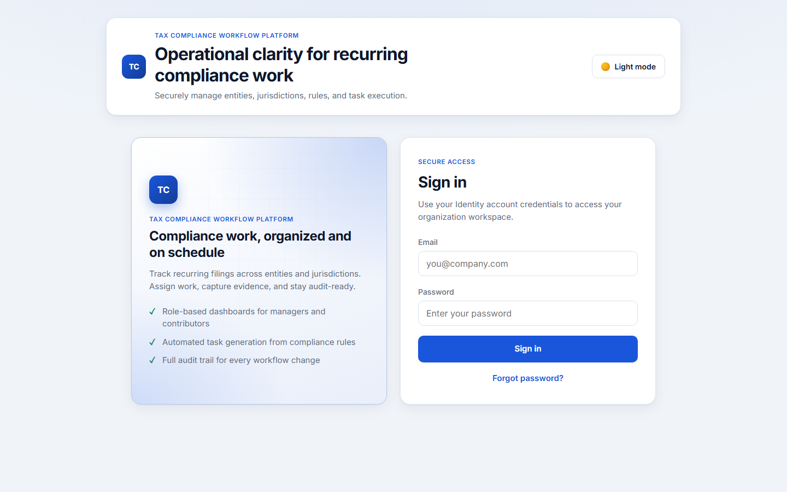 | 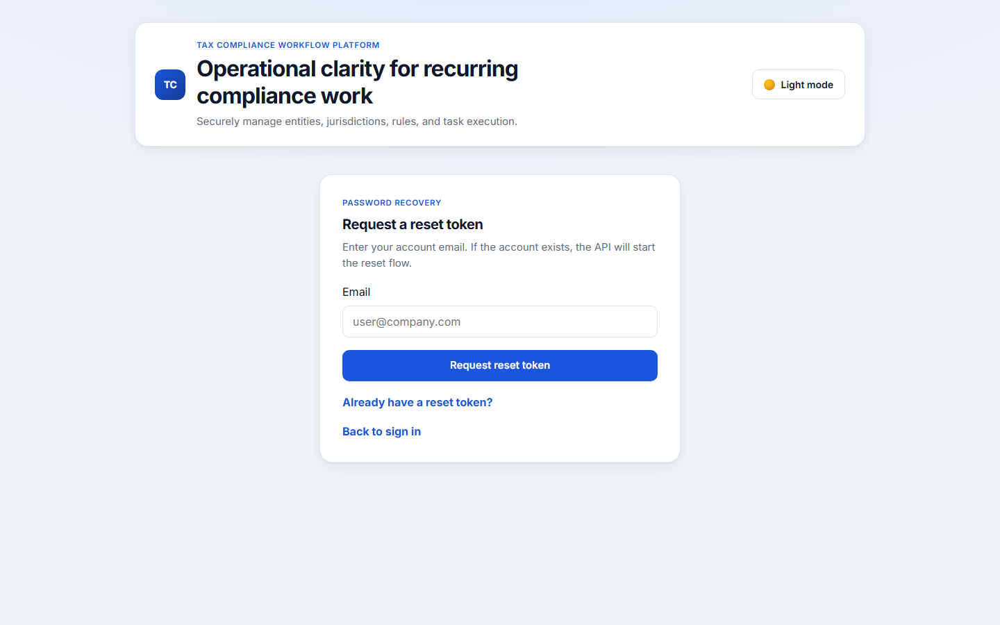 |

### Dashboard

Operations overview with overdue/due-soon metrics, completion trends, and jurisdiction/entity drill-downs.

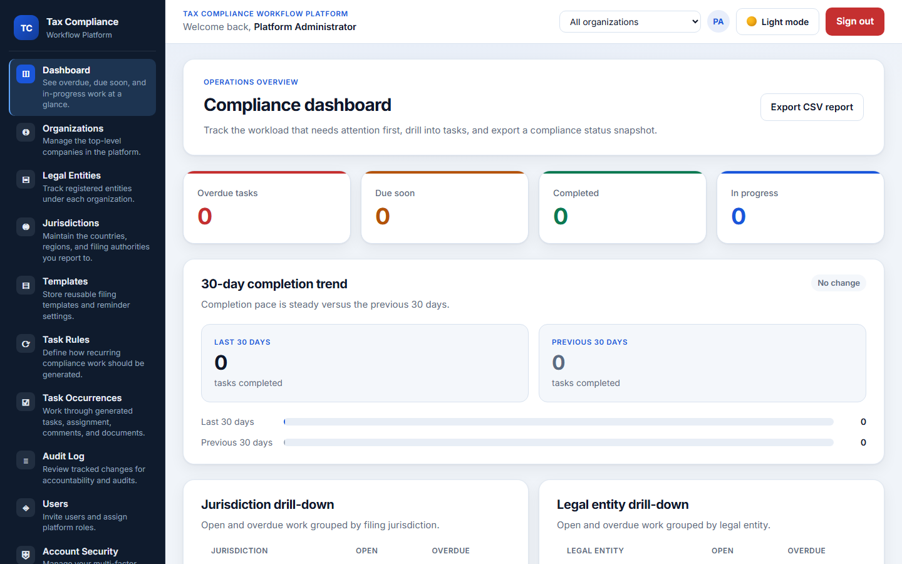

### Master data management

| Organizations | Legal entities |
|---------------|----------------|
| 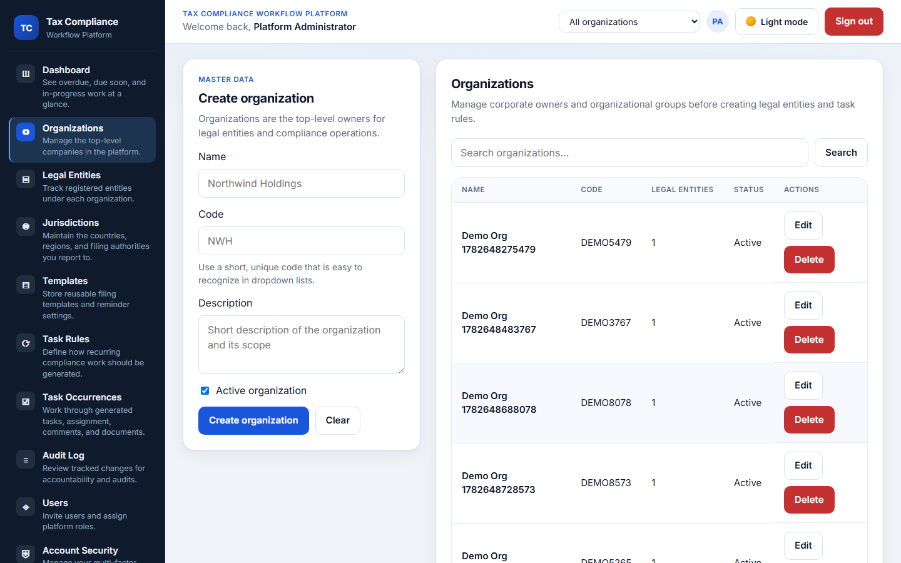 | 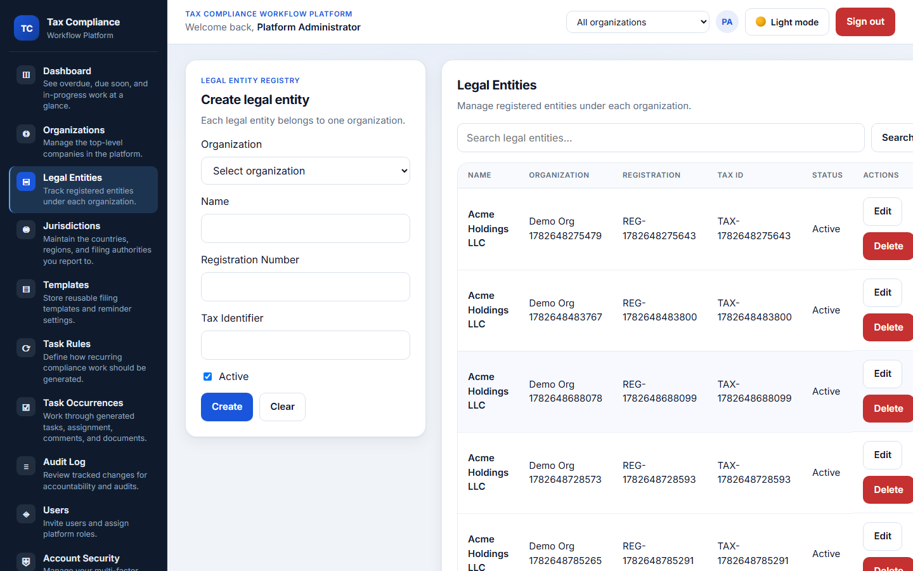 |

| Jurisdictions | Compliance templates |
|---------------|----------------------|
| 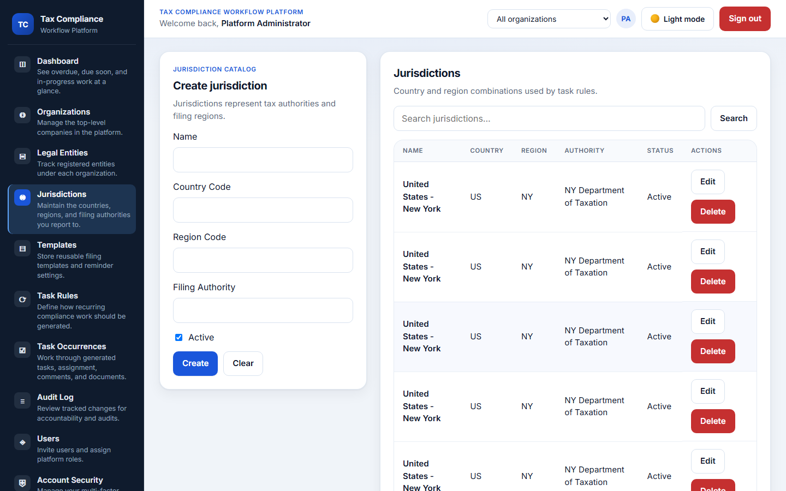 | 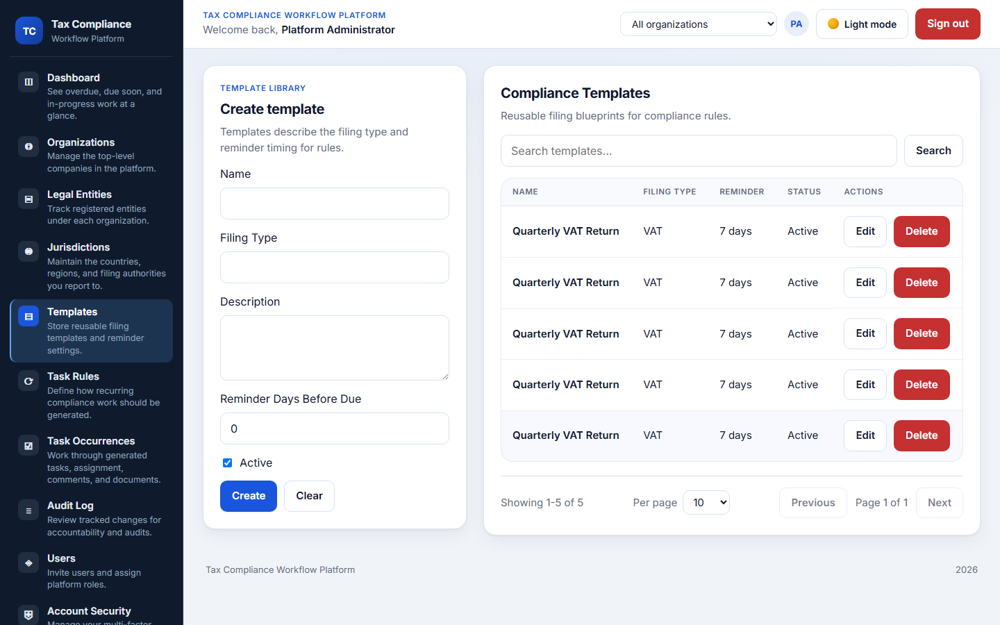 |

| Task rules |
|------------|
| 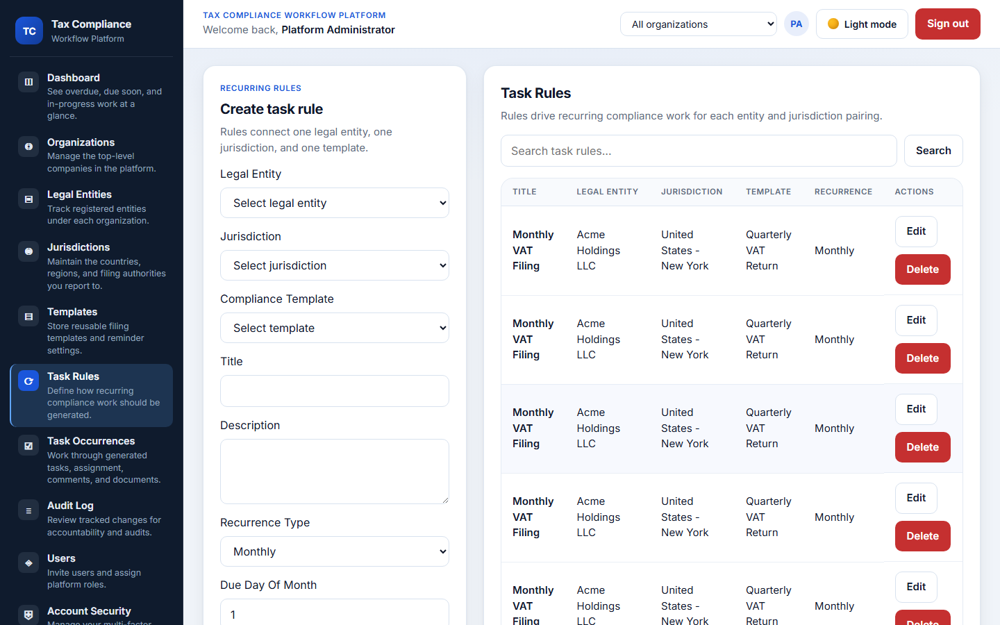 |

### Task workflow

| Task occurrences list | Task occurrence detail |
|-----------------------|------------------------|
| 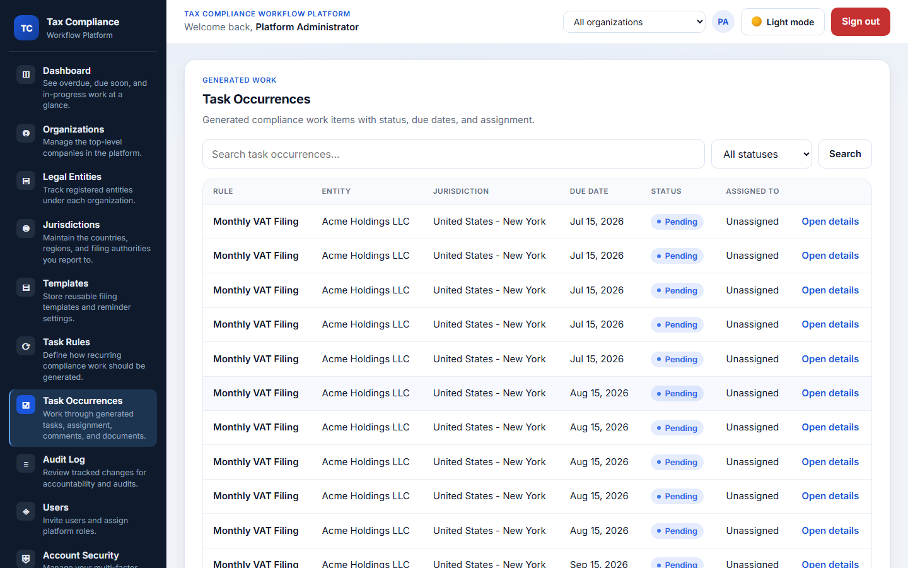 | 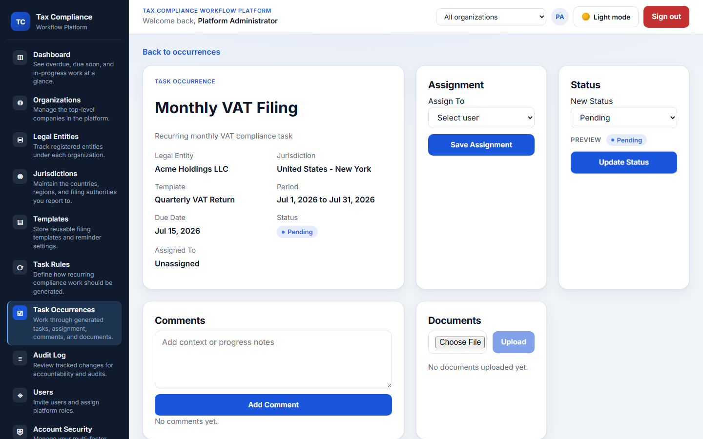 |

Assignment, status updates, comments, document uploads, and audit history are available on the detail screen.

### Administration and security

| Audit log | User management |
|-----------|-----------------|
| 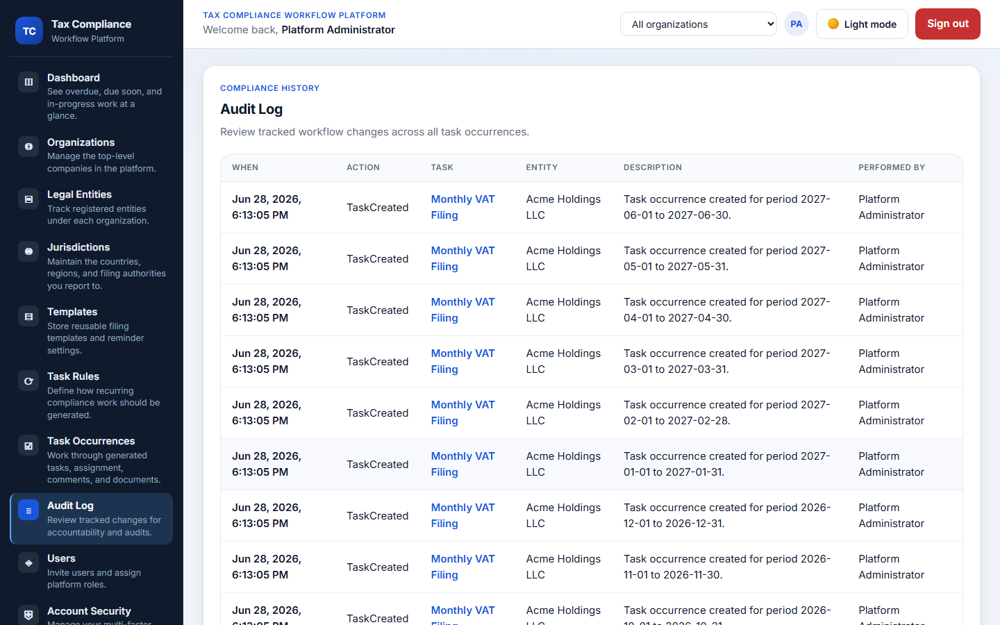 | 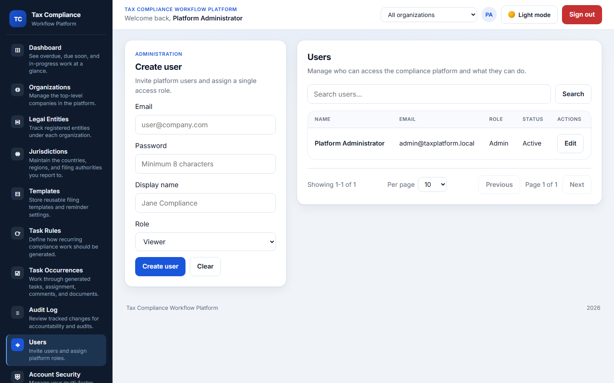 |

| Account security (MFA) |
|------------------------|
| 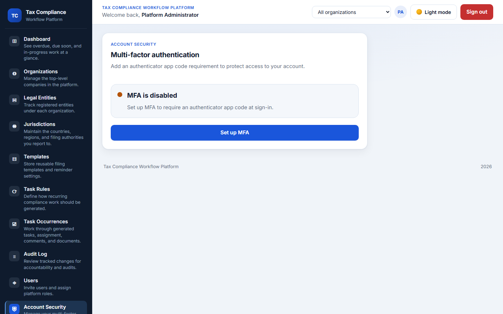 |

### API (Swagger)

Interactive OpenAPI documentation served by the backend at `/swagger`.

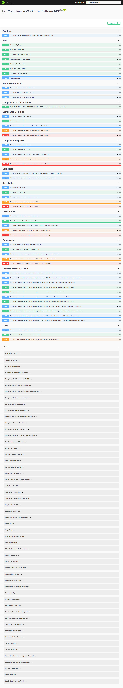

## Note on Hosting / Live Deployment

This project is **not deployed to a live public host**. The hosting step was intentionally left out because running it on a cloud provider incurs ongoing costs, which I chose not to take on for this project. This is a deliberate choice, not a technical limitation — the application is production-ready and I am familiar with how to deploy it (containerized API + frontend, managed PostgreSQL/Redis/RabbitMQ, TLS termination at a reverse proxy, environment-based secrets, and CI/CD).

Everything needed to host it is included and documented:

- Production `docker-compose.production.yml` and Docker images for the API and frontend
- Environment templates ([.env.production.example](.env.production.example), [.env.pilot.example](.env.pilot.example))
- A full deployment checklist in [docs/deployment.md](docs/deployment.md)

To run it locally end to end, follow the [Quick Start](#quick-start) below.

## What Is In This Repository

- `backend/`
  - ASP.NET Core Web API on port **8080** (local `dotnet run`)
  - Clean layers: `Domain`, `Application`, `Infrastructure`, `Api`
  - ASP.NET Core Identity with JWT authentication
  - EF Core persistence, Redis caching, RabbitMQ notifications
  - Global audit log API, admin user management, health checks
  - xUnit unit and integration tests
- `frontend/`
  - Angular 18 standalone application on port **4200**
  - Auth flow, route guards, bearer-token interceptor
  - CRUD management screens, dashboard, task workflow, audit log, user admin
- `docker-compose.yml`
  - Infrastructure: PostgreSQL, Redis, RabbitMQ
  - Optional `--profile full` for API + static frontend containers

## Current Feature Coverage

- Authentication and role-based authorization
- Roles: `Admin`, `ComplianceManager`, `Contributor`, `Viewer`
- Seeded admin account (Development only without explicit env vars)
- CRUD APIs for organizations, legal entities, jurisdictions, templates, and task rules
- Recurring task generation (monthly, quarterly, yearly)
- Task occurrence workflow: assignment, status, comments, documents, audit trail
- Global paginated audit log (`/api/audit-log` + UI)
- Admin user management (`/api/users` + UI)
- Dashboard summary with Redis caching
- Health endpoint at `/health`
- File upload size and extension validation
- Organization-scoped multi-tenant data access (`OrganizationId` on users, jurisdictions, templates; org filtering across services)
- Paginated list APIs (`page`, `pageSize`, `search`) for organizations, legal entities, jurisdictions, templates, task rules, task occurrences, users, and audit log
- Refresh tokens, password reset, and optional TOTP MFA (`/api/auth/refresh`, `/api/auth/forgot-password`, `/api/auth/reset-password`, `/api/auth/mfa/*`)
- Contributor server-side "my tasks" filter on task occurrence lists
- Serilog structured logging and OpenTelemetry tracing (ASP.NET Core + HTTP client instrumentation)
- Playwright smoke tests in `e2e/` and backend workflow smoke integration test

## Repository Layout

```text
backend/
  src/
    TaxCompliance.Domain/
    TaxCompliance.Application/
    TaxCompliance.Infrastructure/
    TaxCompliance.Api/
  tests/
    TaxCompliance.Tests/
frontend/
  src/app/
    core/
    features/
    shared/
    theme/
docker/
docs/
scripts/
storage/uploads/
.github/workflows/
```

## Prerequisites

- .NET SDK 8
- Node.js 20+
- npm 10+
- Docker Desktop (for Postgres, Redis, RabbitMQ)

## Quick Start

### Option A: Local processes (recommended for development)

1. Start infrastructure:

```bash
docker compose up -d
```

Or on Windows PowerShell:

```powershell
.\scripts\start-dev.ps1
```

2. Run the API (listens on **http://localhost:8080**):

```bash
dotnet restore backend/TaxCompliance.sln
dotnet run --project backend/src/TaxCompliance.Api/TaxCompliance.Api.csproj
```

3. Run the frontend:

```bash
cd frontend
npm install
npm start
```

4. Open [http://localhost:4200](http://localhost:4200) and sign in with the seeded admin account.

### Option B: Full stack in Docker

```bash
docker compose --profile full up -d --build
```

- API: [http://localhost:8080/swagger](http://localhost:8080/swagger)
- Frontend: [http://localhost:4200](http://localhost:4200)
- The containerized frontend is served by nginx and proxies `/api` to the API container.

## Infrastructure Services

| Service | URL / Port |
|---------|------------|
| PostgreSQL | `localhost:5432` |
| Redis | `localhost:6379` |
| RabbitMQ | `localhost:5672` |
| RabbitMQ management UI | [http://localhost:15672](http://localhost:15672) (guest/guest) |
| API | [http://localhost:8080](http://localhost:8080) |
| Health check | [http://localhost:8080/health](http://localhost:8080/health) |

## Seeded Admin Credentials (Development)

- Email: `admin@taxplatform.local`
- Password: `Admin123!`

## Environment Variables

Copy [.env.example](.env.example) for local overrides. Important production settings:

| Variable | Purpose |
|----------|---------|
| `Jwt__SigningKey` | JWT signing secret (min 32 chars in Production) |
| `Seed__AdminEmail` | Initial admin email (required outside Development) |
| `Seed__AdminPassword` | Initial admin password (required outside Development) |
| `ConnectionStrings__DefaultConnection` | PostgreSQL connection string |
| `ConnectionStrings__Redis` | Redis connection string |
| `Cors__AllowedOrigins__0` | Public frontend origin when frontend and API are on different origins |
| `PasswordReset__ClientResetUrl` | Public password reset page URL for outbound reset emails |
| `NG_APP_API_BASE_URL` | Frontend production API base URL baked in at build time |
| `Email__SmtpHost` / `Email__Password` | SMTP delivery settings for production email |
| `RabbitMq__UserName` / `RabbitMq__Password` | RabbitMQ credentials outside local development |

`appsettings.Production.json` ships with empty secrets — override them via environment variables or your secret manager.

See [docs/deployment.md](docs/deployment.md) and [.env.production.example](.env.production.example) for the production deployment checklist.

## Running Tests

Backend:

```bash
dotnet test backend/TaxCompliance.sln
```

Frontend:

```bash
cd frontend
npm install
npm test
```

## CI

GitHub Actions workflow at `.github/workflows/ci.yml` runs release quality gates on every push and pull request:

- **Security**: dependency review (PRs), NuGet/npm vulnerability audits, and Trivy filesystem scans that fail on high/critical findings
- **Backend**: Release build, `dotnet publish` verification, tests with a 45% line-coverage gate
- **Frontend**: production Angular build (`npm run build:production`), Karma tests with coverage thresholds
- **Docker**: API and frontend image builds with Trivy image scans
- **E2E**: Playwright smoke tests for sign-in, password recovery entry point, dashboard load, and a representative task workflow

See [docs/ci.md](docs/ci.md) for job details, local reproduction commands, and remediation guidance when a gate fails.

## Architecture Docs

- [architecture.md](architecture.md)
- [docs/architecture-overview.md](docs/architecture-overview.md)
- [docs/post-launch-backlog.md](docs/post-launch-backlog.md) — UX polish and reporting deferred until after launch readiness

## License

Released under the [MIT License](LICENSE).

## Security Notes

- `AuthorizationDemoController` is disabled outside Development.
- Do not commit real secrets; use environment variables.
- Configure explicit CORS origins for cross-origin production deployments.
- File uploads are limited to configured extensions and max size (default 10 MB).
